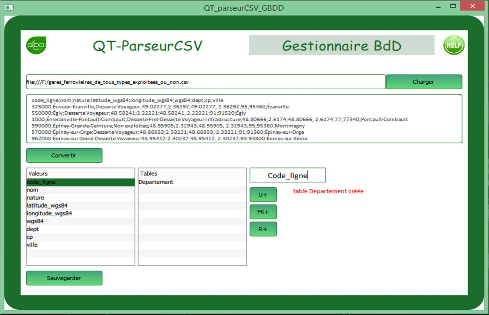

# QT_BDD_CSV

Lecture des fichiers .CSV et extraction des données en vue de l'implémentation d'une base de données respectant un MPD.

##Fonctionnalités : 
- lecture de fichiers .csv ;
- extraction des données par colonnes (valeurs nulles et valeurs multiples inclues) ;
- création de tables [ UNITAIRE( id, attribut ) ; WITHFK( id, #Fk, attribut ) ; RELATION( id1,  id2, attribut ) ] ;
- enregistrement des tables créées sous forme de fichiers .CSV ;

- Connexion à MYSQL ; 
- Gestion des bases de données (création, suppression, …) ;
- Exécution de scripts ; 
- Aide à l’insertion de données via fichiers .CSV ;
- Affichage des résultats des requêtes en TableView.

